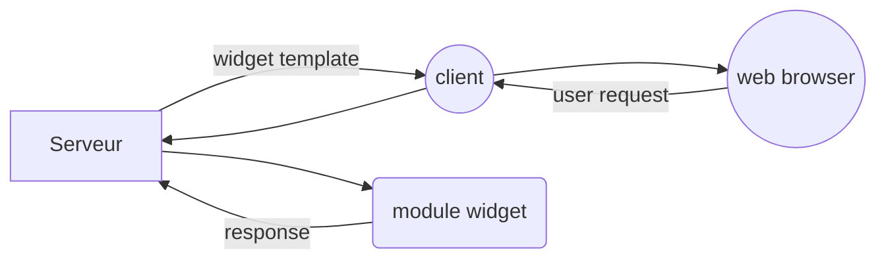

# Epitech Dashboard

Projet epitech dont le but est de creer un dashboard avec plusieurs service.

voici les service disponibles :
- service meteo ( affiche la meteo dans la ville demandé )
- stats de chaine youtube (affiche les stats d'un chaine youtube donnée)
- steam games (affiche le nombre de joueurs actif sur un jeu steam)
- steam profile  (affiche les jeu disponible sur un profils steam)
- github repo ( affiche les stats d'un repo git de l'utilisateur , si il est connecté )

## UML diagrams

